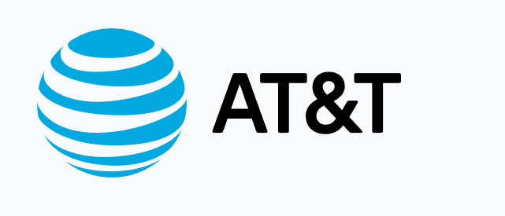

# AT&T — Détecteur de SPAM

Projet réalisé dans le cadre du bloc 4 de la certification CDSD (Jedha).

---

## Contexte

AT&T cherche à automatiser la détection de SMS indésirables pour protéger ses utilisateurs. L'objectif : construire un modèle capable de classifier un SMS comme spam ou ham (message légitime) en se basant uniquement sur son contenu.

---

## Ce que j'ai fait

Comparaison de trois approches par ordre croissant de complexité :

1. **Baseline — TF-IDF + Régression Logistique** : référence classique, déjà très performante sur ce type de problème
2. **TextCNN from scratch** : réseau convolutif entraîné sur les données, avec embeddings appris et double kernel (3 et 5) pour capturer des patterns de longueurs différentes
3. **Transfer Learning — DistilBERT** : fine-tuning d'un modèle pré-entraîné sur des milliards de tokens, adapté à la classification binaire

---

## Résultats

| Modèle | Accuracy | F1 spam |
|--------|----------|---------|
| Baseline (TF-IDF + LogReg) | 0.981 | 0.929 |
| TextCNN | 0.969 | 0.890 |
| **DistilBERT** | **0.994** | **0.976** |

DistilBERT est le meilleur modèle. La baseline reste compétitive et largement suffisante en production pour ce dataset.

---

## Stack

- Python — PyTorch, Transformers (HuggingFace), Scikit-learn
- Dataset : 5 572 SMS (spam.csv — AT&T)

---

## Structure

```
ATT/
├── data/
│   ├── raw/
│   │   └── spam.csv
│   └── processed/
├── docs/
│   └── 01-AT&T_spam_detector.ipynb   # Énoncé du projet
├── notebooks/
│   └── att.ipynb                      # Notebook principal
├── reports/
│   └── figures/
│       ├── 01_ham_spam_distribution.png
│       ├── 02_word_count_distribution.png
│       ├── 03_confusion_baseline.png
│       ├── 04_confusion_textcnn.png
│       ├── 05_confusion_distilbert.png
│       └── 06_models_comparison.png
├── src/
│   └── export_figures.py
└── README.md
```

---

Julien CHARLIER — [(Github : Atomik31)](https://github.com/Atomik31)
